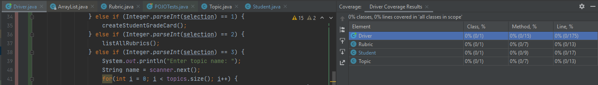
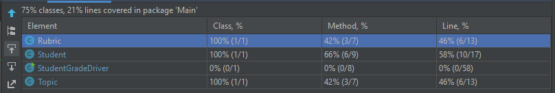
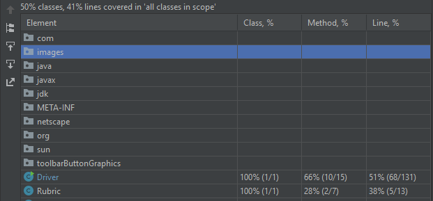
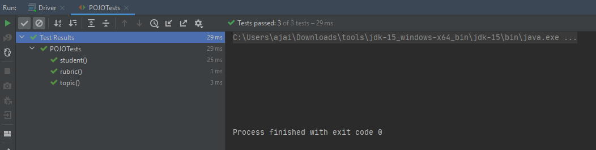
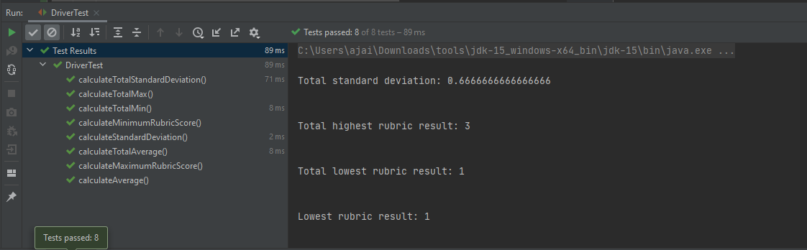

# Scrum sprint backlog and task estimation
## Prioritised Sprint backlog for Student Grade Manager

| Item NO | Backlog Item | Owner | Point Estimation |
| ------ | ------ | ------ |------ |
| 1. | Conduct spike to understand requirements | Ajaideep Singh | 0
| 2. | Create POJOs and write accompanying test cases | Ajaideep Singh | 3
| 3. | Terminal menu template that allows client to access all functionality | Ajaideep Singh | 1
| 4. | Add functionality to menu items and write accompanying test cases | Ajaideep Singh | 5
| 5. | Testing software component | Ajaideep Singh | 1

#### How to choose estimates
To calculate the point estimation for a user story I used planning poker which is a consensus-based technique for estimating the effort of user stories in scrum. Once the product owner reads the agile user story. The team discuss the requirements and ask questions to help educate themselves to decide. We use a sequence of numbers as estimates in scrum known as the Fibonacci sequence ->
0, 1, 2, 3, 5, 8, 13, 20, 40, 100 etc
Each team member selects a card representing their estimate of the size of the story. If all estimators chose the same card, they could move ahead to the next story. They can also revisit stories to re-estimate them.
The reason I have chosen the above points is based on prior experience to the fields highlighted in the back log. I have given five points to item number 4 because this is the bulk of the software component. This story is where all the functionalities will reside that’s why I believe it will be the longest story for me to tackle. I have used backlog item 4 as a benchmark for estimating the points of the rest of the stories. I also used some of my experience from my internship when assigning story points. It is also essential like some stories will take x amount more time than another so you can multiply the points by time taken. For item number two I have assigned 3 points. I have decided it would be worth 1 point to understand and create the hierarchy of the POJOs and 2 points to write the supporting unit test cases. I am not that comfortable with writing unit test cases so I have assigned it roughly 2 points as I will need to do some outside study. I have assigned 0 - 1 points for items that will not take me much time and that I am confident doing.

#### Comparing the difficulty of two tasks with different estimates
Estimate in relative terms rather than absolute terms. For example, if the first user story is a 2. All other items on the list can be estimated relative to this. Something that will take four times as long would get an 8, and so on

#### How the velocity of a sprint is calculated
Velocity is a measure of the amount of work a team can complete during one single sprint. A scrum master calculates the team’s velocity at the end of the sprint. To calculate the velocity, you simply add up the points of the completed stories.

#### How the velocity metric feeds into the next sprint planning?
During sprint planning, the velocity of a team is served as an input to the next sprint. The previous weeks velocity data is used to enhance its use in scrum to deliver customer value. The change in velocity over previous sprints can help a team measure the change in particular processes that can affect the delivery of measurable customer value.

- Estimate how much amount can be delivered by a particular date
- Estimate a date for a committed amount of work to be delivered
- Understand our goals while fixing the amount of work we will commit for a sprint

# Unit testing and Test-Driven development
I have followed a test-driven development approach where the approach is broken into test cases which are developed to specify and validate what the code will do.
[An example of a commit that follows a test driven development approach](https://github.com/AjaideepSingh/SQACA_Ajaideep/commit/a161b5942e0a8fd4ca358ef1b8973c30f6eedc22)
Within this commit I have created unit tests for all the POJOs. The three POJOs I have tested are ->
 - Student Object
 - Topic Object
 - Rubric Object

I have created test cases when developing the main functionality as well so there should be test cases along with majority of commits which can be seen within the GitHub repository.

In the POJO test cases I ensure that each Object is covered by a test. This is the ensure code correctness as in if the test is to pass the code logic is correct based on the dummy data, I have provided in the unit tests. I will cover the gap closed by writing unit tests in terms of code coverage later. You can note from the commit that the quality of the code is improved by following this approach. We can note that majority of the commits have supporting unit test cases. Following this approach now will save project costs in the future, remove code smells and grey areas.

Majority of my application is terminal print outs and scanning user input. I have only written unit tests to cover the main functionality of the app i.e., POJO test cases and summary calculation test cases.

# Test coverage metric
#### What is code coverage?
Code coverage is the percentage of code which is covered by automated tests. Code coverage measurement simply determines which statements in a body of code have been executed through a test run, and which statements have not. We can distinguish code that has been run through a test and code that has not based on if the code has a green or red block beside the line.

 - Green -> Lines of code are covered by a unit test
 - Red -> Lines of code are not covered by a unit test

To find out the code coverage of a java class you simply right click on the class and select "run "nameOfClass.main()" with coverage". You can also find out the code coverage of any given class without running them. This following technique is helpful when trying to find the code coverage of multiple classes without running them. For running the tests, I used IntelliJs built in testing tool, you can also use third party plugins. Using this IDE tool helps identify the gaps in which lines of code are covered by a unit test or not. The figures below should help identify the gaps closed when running the code coverage tool without any test cases and with test cases.

- Within the IntelliJ IDE use ctrl alt f6 to find code coverage of a given class
- Note this may vary based on the IDE you are using

#### Before writing any unit tests

*The above figure shows the code coverage results before any unit tests have been written*

#### The gap closing after writing unit tests for POJOs

*The above figure shows the code coverage results after unit tests have been written, We can straight away note the gap closed*

#### The gap closing after writing unit tests for the Driver class

#### POJO tests passing

#### Driver class tests passing

# Team Version Control

For the purposes of this project, I have followed a Git flow approach when working on this project
I have created the following branches ->
 - Main
 - develop -> This is used for developing the software component and I will create a pull request from this branch to main once the component has been developed and tested
 - develop_README -> There are 5 topics the README.md will contain. I have broken these 5 topics into 5 different branches. Once the 5 topics have been covered, I will create 5 pull requests and once the pull requests have been merged into develop_README, I will ensure everything is up to standard and then finally create a pull request and merge both the software component from the develop branch and the README.md from the develop_README branch into the main branch and I will have completed the project. This is how I will follow the GitFlow process 

The five branches that will be created from the develop_README branch are as follows ->
 - backlog_taskEstimation
 - testing_tdd
 - testCoverageMetric
 - teamVersionControl
 - codeReviewCheckList
All the above branches have their own heading within the README.md file

#### Benefits of following my approach to this project
 - Parallel development. One of the great things about GitFlow is that it makes parallel development very easy, by isolating new development from finished work
 - Collaboration
 - Release staging area
 - Support for emergency fixes